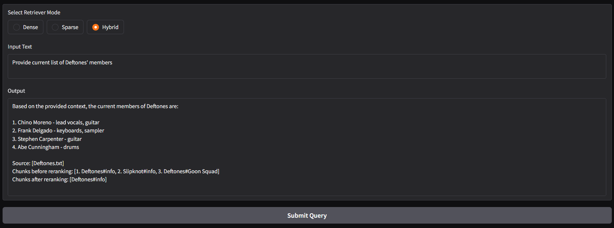
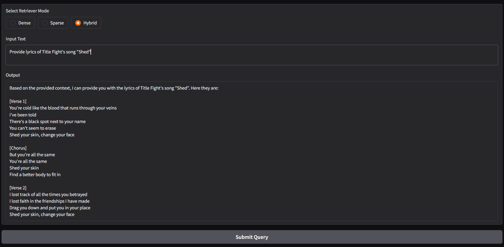

# Music-based RAG

**Data source:**

My RAG application specializes in music. More precisely, on some of the artist that I scrapped from [Genius website](https://genius.com/) and extracted info about artist and their most popular songs (maximum 100).

**Chunking:**

I splitted my dataset in a such way. Let I scrapped $n$ songs of an artist. Then my spliiter will split each song as one chunk. And 1 more chunk for info about the artist. So we have $n+1$ chunks per artist ($n$ is limited to 100). The total number of chunks are 4500, because not every artist had at least 100 songs

**Files:**
- `Dockerfile` - file to build docker image
- `extract_embeddings_lchain.py` - code for extracting embeddings for my dataset and uploading into the vector DB
- `parse_genius.py` - code of parsing [Genius](https://genius.com/) using `lyricsgenius` library
- `generate_txt.py` - `parse_genius.py` parsed the data in json format so here I converted the data from json into txt format
- `splitter.py` - My own splitter. I splitted my dataset in a such way. Let I scrapped $n$ songs of an artist. Then my spliiter will split each song as one chunk. And 1 more chunk for info about the artist. So we have $n+1$ chunks per artist ($n$ is limited to 100). The total number of chunks are 4500, because not every artist had at least 100 songs
- `updatting_metadata.py` - initially I forgot to include id of chunk into metadata, that's why I update vector DB by append id of chunk into metadata.
- `rag_lchain.py` - The main file in this repo that implements the logic of RAG. I used Langchain because I initially wanted to implement tool calling but things didn't go well. Then I decided not to remove Langchain in order not to rewrite the code.
- `sparse_encoder.json` - the encoder in json format

- **Stack:**
    - **LLM:** llama3-8b-8192
    - **LLM-provider:** LangChain + Groq
    - **Vector DB:** Pinecone
    - **Reranking model:** BAAI/bge-reranker-base
    - **UI:** Gradio

- **List of artists:**
    - **Nu-metal**: Deftones, Linkin Park, Korn, Slipknot, System of A Down, Limp Bizkit
    - **Electronic music**: Crystal Castles, Snow Strippers, Shoegaze: Superheaven, Slowdive, Sunny Day Real Estate, Title Fight
    - **Punk rock**: Blink 182, Sum 41, DUCKBOY
    - **Rap:** Bones, A\$AP Rocky, Travis Scott, Lil Uzi Vert, Future, \$uicideboy\$, Yeat, Playboi Carti, Lil Peep, Kendrick Lamar, 21 Savage, Destroy Lonely, Ken Carson, Bladee, Yung Lean, J. Cole, Eminem, Young Thug, Gunna
    - **Other:** Nirvana, Bring Me The Horizon, Misfits, The Smiths, Evanescence, Twin Tribes, TOOL, Metallica, Joy Division, Lebanon Hanover, The Cure, Marilyn Manson, The Weeknd

An Example:

Another one 

The project is hosted on HuggingFace Spaces - [https://huggingface.co/spaces/melnnnnn/rag-llm](https://huggingface.co/spaces/melnnnnn/rag-llm).

But to try the RAG you need GROQ API KEY and PINECONE API KEY, so if you wanna get it - dm me